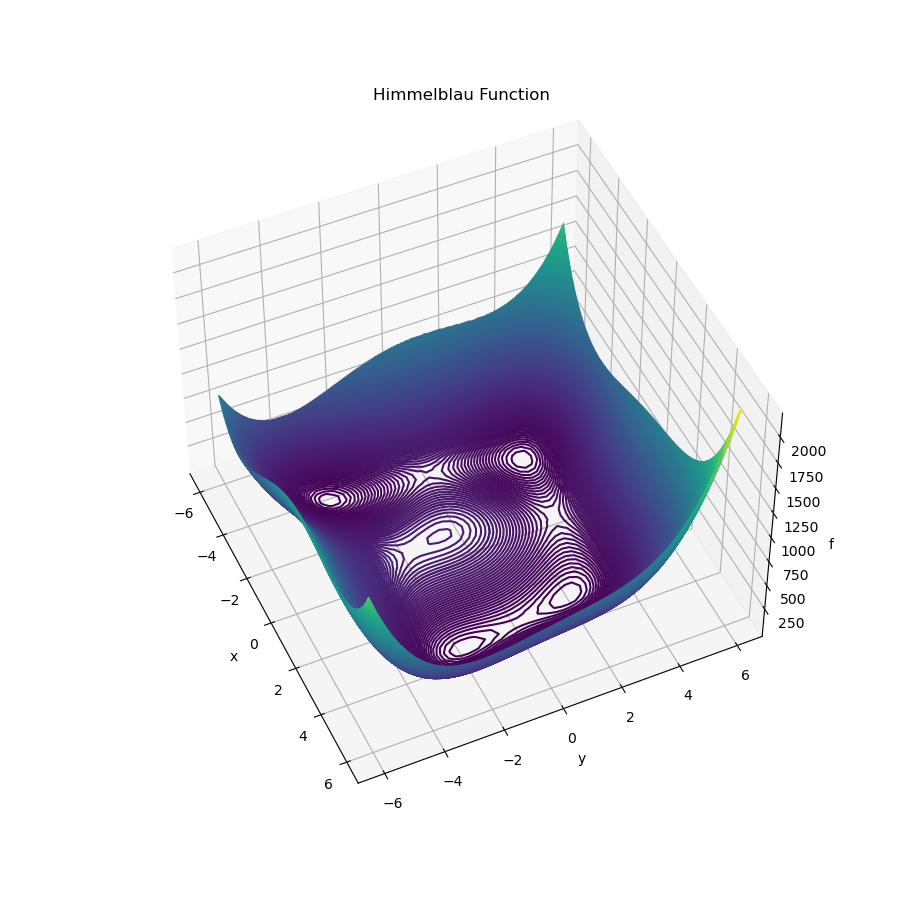

# Metaheuristics
This repot implement some metaheuristics and cost functions. 

## Metaheuristics
### JAYA
Implement Jaya optimizer without constraints.

## Cost functions
* Himmelblau's function
[Himmelblau.png]()

## References
[1]R. Venkata Rao, Jaya: An Advanced Optimization Algorithm and its Engineering Applications. Cham: Springer International Publishing, 2019. doi: 10.1007/978-3-319-78922-4.
[2]Wikipedia contributors, « Test functions for optimization », Wikipedia, The Free Encyclopedia., juin 27, 2021. https://en.wikipedia.org/w/index.php?title=Test_functions_for_optimization&oldid=1030693803 (consulté le oct. 01, 2021).